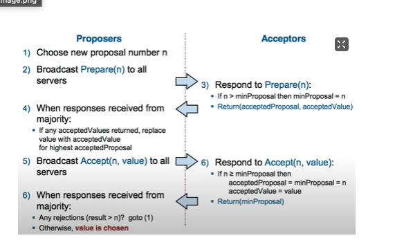

# MyPaxos

## basic paxos
自己实现的basic paxos算法

心跳超时时间: 60S
触发心跳: 100ms

项目启动时都是acceptor，通过心跳获取集群里的配置，并且持久化配置。

### 优势

1. 无主，没有选举的延迟
2. 通过paxos可以实现强一致性

### 缺陷

1. paxos的服务节点需要知道quorum是多少？需要广播配置，或者一个中心来告诉配置。
2. 只有proposer知道哪个值被选中，所有响应accept的服务器的确也都有值，但是不知道该值有没有被选中
3. 若其他服务器想要明确知道被选中的值，需要基于序号执行paxos
4. 延迟高，rtt多，还有活锁问题

项目的一些文档

https://www.yuque.com/docs/share/61ee0856-f3c4-4549-bba9-49c5d639ceec?# 《Paxos lecture》
https://www.yuque.com/docs/share/32daedce-f2cc-4583-a2b1-f6ef4588a7b2?# 《The Paxos algorithm》

## multi-paxos

目的：实现多副本冗余系统(multi-replicated log)

paxos通过多轮prepare/accept来确定一个值，将这个过程称为paxos的实例。

方式：使用一组彼此独立的paxos实例，每个basic paxos的实例来决定log中的一条记录，因此需要给prepare和accept增加一个参数，index，用来表示这个basic paxos在决策哪一条log。而状态机必须按步骤一步步执行log。

### 优点

+ 高效，节点通信无须验证身份签名。
+ Paxos算法有严格的数学证明，系统设计精妙。
+ 容错性能: 允许半数以内的Acceptor失效、任意数量的Proposer失效，都能运行。 ⼀旦value值被确定，即使 半数以内的Acceptor失效，此值也可以被获取，并不会再修改。

### 缺点

+ 工程实践比较难，达到工业级性能需要进行不同程度的工程优化，而有时工程设计的偏差会造成整个系统的崩溃
+ 只适用于permissioned systems(私有链)，只能容纳故障节点(fault)，不容纳作恶节点(corrupt)。支持CFT(Crash Fault Tolerant)，不支持拜占庭容错(Byzantine Fault Tolerance)。

